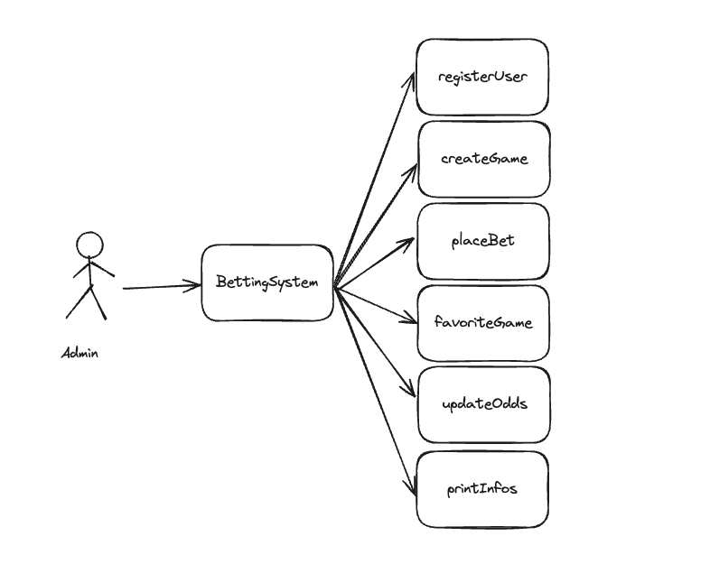

## Design Patterns - Bet System

This repository is intended for a practical exercise on the subject of design patterns. The main idea is to implement
the following patterns in a fictitious system:

- Creational: Singleton and Builder
- Structural: Facade
- Behavioral: Observer

The fictitious system chosen is a betting system that will have the following models:

- Game
- User
- Bet

And the following options:

- Create game,
- Register user,
- Place bet
- Update game odds
- Favorite game

The design patterns will be applied as follows:

### Builder:

`Bet` object will be created using this pattern, where it will be possible to create bets with the following structure:

```
val bet = Bet.Builder()
   .bettor(bettor)
   .amount(amount)
   .game(game)
   .chosenOdd(chosenOdd)
   .build()
```

### Singleton

`BettingDatabase` stores the data, but it represents a database connector, which would be recommended to have only a
single instance in the project to avoid creating multiple connections that would generate inconsistencies.

### Facade

It is applied in the `BettingSystem`, which acts as an abstraction for the logic of creating and
manipulating system objects.



### Observer

It is applied between the `User` and `Game`, through the `GameObserver` interface. The `Game` object has a
function `addObserver`, which waits for a `GameObserver` object and saves it in a list (the `User` object implements this
interface, so it can be added as an observer). When some odd value is changed, the `Game` iterates its list and notifies
all linked `User` objects.
